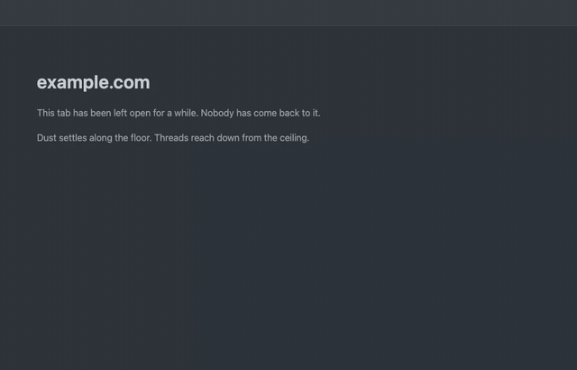

# Arachne

A Chrome extension that lets idle tabs fall into disrepair. The longer a tab goes unvisited, the more it grows cobwebs across the ceiling and gathers dust along the floor. Everything is drawn procedurally on a canvas, with no images and no third-party libraries.

The result is interactive: poke the web to make it sway, or sweep dust and tear cobwebs away with the cursor like a broom.

> The demo scrubs through the decay stages, then sweeps the floor dust and tears the cobwebs. The effect is intentionally faint and semi-transparent in normal use.

## Features

- Procedural spider web simulated as a mass-spring system with real gravity and sag.
- Decay driven by how long a tab has been idle, across four stages from nascent to collapsed.
- Brushable dust and sweepable, tearable webs.
- Stops simulating and drops to near-zero CPU once everything settles; wakes only on interaction.
- Deterministic per site: the same site always grows the same web.

## Install

This is an unpacked Manifest V3 extension.

1. Open `chrome://extensions`.
2. Enable Developer mode.
3. Choose "Load unpacked" and select this directory.

After editing any source file, reload the extension and refresh the target tab.

## Usage

Leave a tab idle and revisit it to see it age. To preview without waiting, click the toolbar icon to open the debug popup, which has stage buttons and a slider to scrub the full lifecycle. Set a later stage to see dust and a mature web, then move the cursor over the floor, the corners, or the web to interact.

## Documentation

See [docs/ARCHITECTURE.md](docs/ARCHITECTURE.md) for how the simulation, rendering, and auto-sleep work.

## License

Released under the [MIT License](LICENSE).
